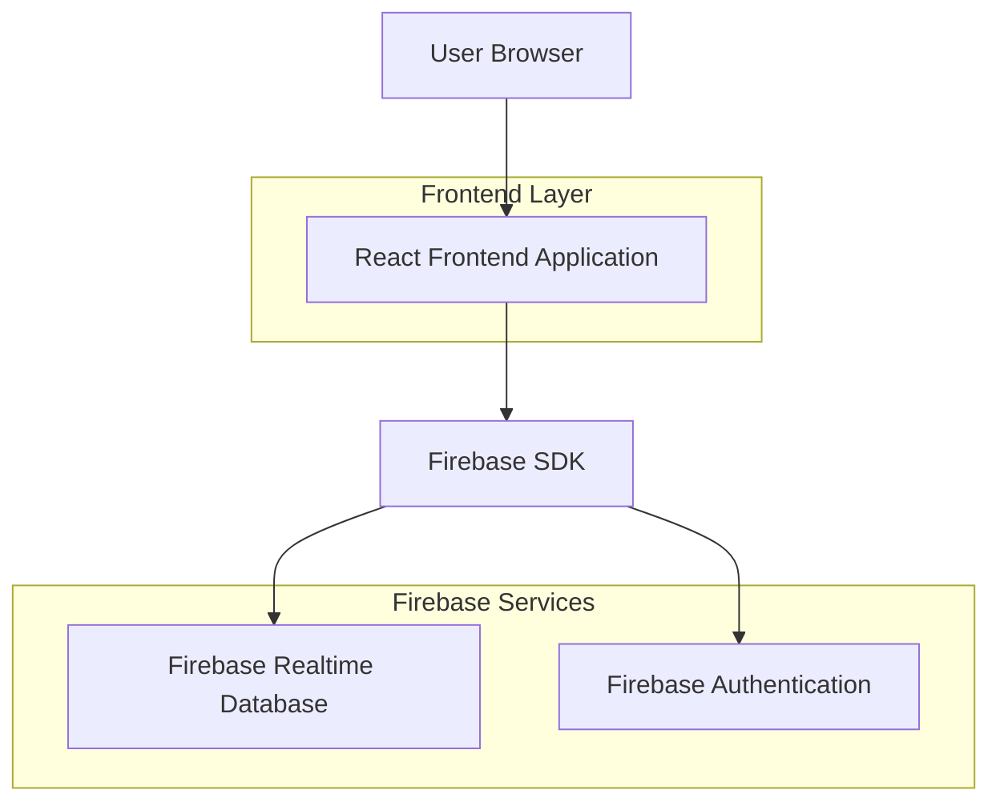
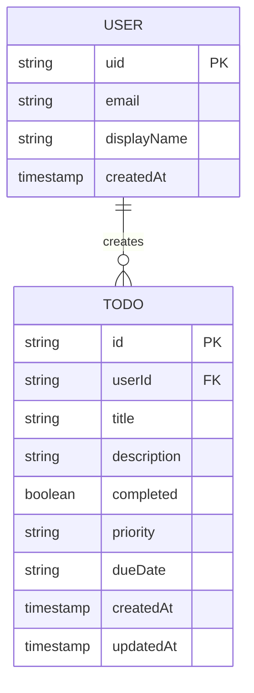

# TodoList 技术架构文档

## 1. 架构设计



## 2. 技术描述

- Frontend: React@18 + TypeScript + Tailwind CSS + Vite
- Backend: Firebase Realtime Database
- Authentication: Firebase Authentication
- Real-time Sync: Firebase SDK

## 3. 路由定义

| Route | Purpose |
|-------|----------|
| / | 主页，显示任务列表和管理界面 |
| /login | 用户登录页面（如需要认证） |
| /settings | 用户设置页面 |

## 4. API定义

### 4.1 Firebase Realtime Database 结构

```json
{
  "todos": {
    "userId": {
      "todoId1": {
        "id": "string",
        "title": "string",
        "description": "string",
        "completed": "boolean",
        "priority": "high | medium | low",
        "dueDate": "string | null",
        "createdAt": "timestamp",
        "updatedAt": "timestamp"
      }
    }
  },
  "users": {
    "userId": {
      "email": "string",
      "displayName": "string",
      "createdAt": "timestamp"
    }
  }
}
```

### 4.2 Firebase SDK 操作

**添加任务**
```typescript
const addTodo = async (todo: Omit<Todo, 'id'>) => {
  const todosRef = ref(database, `todos/${userId}`);
  const newTodoRef = push(todosRef);
  await set(newTodoRef, {
    ...todo,
    id: newTodoRef.key,
    createdAt: serverTimestamp(),
    updatedAt: serverTimestamp()
  });
};
```

**获取任务列表**
```typescript
const getTodos = () => {
  const todosRef = ref(database, `todos/${userId}`);
  return onValue(todosRef, (snapshot) => {
    const data = snapshot.val();
    const todos = data ? Object.values(data) : [];
    setTodos(todos);
  });
};
```

**更新任务**
```typescript
const updateTodo = async (todoId: string, updates: Partial<Todo>) => {
  const todoRef = ref(database, `todos/${userId}/${todoId}`);
  await update(todoRef, {
    ...updates,
    updatedAt: serverTimestamp()
  });
};
```

**删除任务**
```typescript
const deleteTodo = async (todoId: string) => {
  const todoRef = ref(database, `todos/${userId}/${todoId}`);
  await remove(todoRef);
};
```

## 5. 数据模型

### 5.1 数据模型定义



### 5.2 TypeScript 类型定义

```typescript
// Todo类型定义
export interface Todo {
  id: string;
  title: string;
  description?: string;
  completed: boolean;
  priority: 'high' | 'medium' | 'low';
  dueDate?: string;
  createdAt: number;
  updatedAt: number;
}

// 用户类型定义
export interface User {
  uid: string;
  email: string;
  displayName?: string;
  createdAt: number;
}

// Firebase配置类型
export interface FirebaseConfig {
  apiKey: string;
  authDomain: string;
  databaseURL: string;
  projectId: string;
  storageBucket: string;
  messagingSenderId: string;
  appId: string;
}
```

## 6. Firebase配置

### 6.1 Firebase项目设置

1. 在Firebase控制台创建新项目
2. 启用Realtime Database
3. 配置数据库规则
4. 获取项目配置信息

### 6.2 数据库安全规则

```json
{
  "rules": {
    "todos": {
      "$userId": {
        ".read": "$userId === auth.uid",
        ".write": "$userId === auth.uid",
        "$todoId": {
          ".validate": "newData.hasChildren(['id', 'title', 'completed', 'createdAt', 'updatedAt'])"
        }
      }
    },
    "users": {
      "$userId": {
        ".read": "$userId === auth.uid",
        ".write": "$userId === auth.uid"
      }
    }
  }
}
```

### 6.3 环境变量配置

```env
VITE_FIREBASE_API_KEY=your_api_key
VITE_FIREBASE_AUTH_DOMAIN=your_project.firebaseapp.com
VITE_FIREBASE_DATABASE_URL=https://your_project.firebaseio.com
VITE_FIREBASE_PROJECT_ID=your_project_id
VITE_FIREBASE_STORAGE_BUCKET=your_project.appspot.com
VITE_FIREBASE_MESSAGING_SENDER_ID=your_sender_id
VITE_FIREBASE_APP_ID=your_app_id
```

## 7. 实时同步机制

### 7.1 数据监听

- 使用Firebase的`onValue`监听器实现实时数据同步
- 当数据发生变化时，自动更新UI
- 支持多设备同步

### 7.2 离线支持

- Firebase SDK自动处理离线缓存
- 离线时的操作会在重新连接时同步
- 提供连接状态监听

### 7.3 冲突解决

- 使用Firebase的服务器时间戳避免时间冲突
- 最后写入优先的冲突解决策略
- 乐观更新机制提升用户体验

## 8. 性能优化

### 8.1 数据查询优化

- 使用索引优化查询性能
- 限制查询结果数量
- 分页加载大量数据

### 8.2 缓存策略

- Firebase SDK内置缓存机制
- 本地状态管理减少网络请求
- 预加载常用数据

### 8.3 网络优化

- 批量操作减少网络请求
- 压缩数据传输
- 连接池管理

## 9. 错误处理

### 9.1 网络错误

- 网络连接失败重试机制
- 离线状态提示
- 数据同步状态显示

### 9.2 权限错误

- 用户认证失败处理
- 数据访问权限检查
- 友好的错误提示

### 9.3 数据验证

- 客户端数据验证
- 服务端规则验证
- 数据格式检查

## 10. 安全考虑

### 10.1 认证安全

- Firebase Authentication集成
- JWT令牌验证
- 会话管理

### 10.2 数据安全

- 数据库访问规则
- 用户数据隔离
- 敏感信息加密

### 10.3 传输安全

- HTTPS加密传输
- API密钥保护
- 跨域请求限制